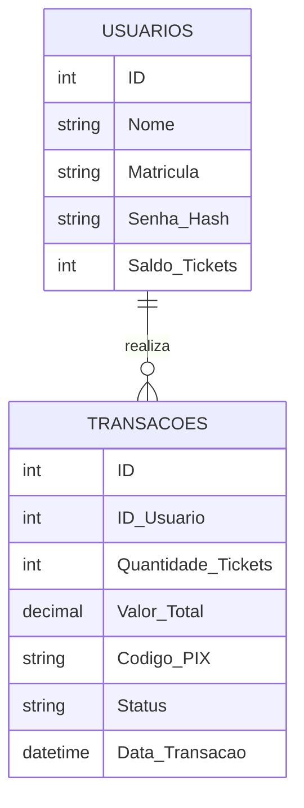
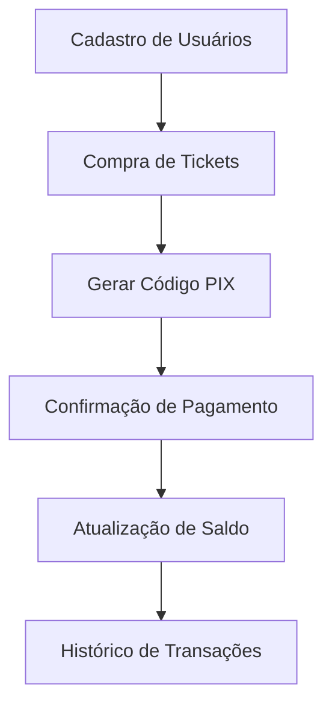

---

# Proposta de Projeto: Sistema de Recarregamento de Carteirinha Estudantil

## Sumário

1. [Introdução](#introdução)
2. [Escopo do Projeto](#escopo-do-projeto)
3. [Requisitos do Sistema](#requisitos-do-sistema)
4. [Modelagem de Dados](#modelagem-de-dados)
5. [Diagrama de Conceito](#diagrama-de-conceito)
6. [Diagrama de Fluxo](#diagrama-de-fluxo)
7. [Próximos Passos](#próximos-passos)

---

## Introdução

Este projeto tem como objetivo desenvolver um sistema para recarga de carteirinhas estudantis, permitindo que os estudantes realizem a compra de tickets para transporte ou outros serviços diretamente pelo aplicativo. O sistema gerará um código para pagamento via PIX, atualizará o saldo de tickets após a confirmação do pagamento e permitirá que os usuários visualizem seu saldo disponível.

## Escopo do Projeto

O escopo do projeto inclui:

- Cadastro e autenticação de usuários.
- Interface para compra de tickets e geração de código PIX.
- Atualização automática do saldo de tickets após confirmação de pagamento.
- Histórico de transações realizadas.
- Interface para visualização do saldo de tickets.

## Requisitos do Sistema

### Funcionalidades

1. **Cadastro de Usuários:**
   - ID único.
   - Nome.
   - Matricula.
   - Senha (armazenada como hash).
   - Saldo de tickets.

2. **Compra de Tickets:**
   - ID da transação.
   - Usuário responsável.
   - Quantidade de tickets comprados.
   - Valor total da compra.
   - Geração de código PIX para pagamento.

3. **Confirmação de Pagamento:**
   - Verificação de pagamento via PIX.
   - Atualização do saldo de tickets do usuário.
   - Registro da transação como confirmada.

4. **Histórico de Transações:**
   - Exibição das transações realizadas por cada usuário.

5. **Relatórios:**
   - Relatórios mensais sobre as transações de compra de tickets.

### Não Funcionais

- Segurança dos dados dos usuários, especialmente senhas e transações.
- Escalabilidade para suportar um grande número de usuários.
- Usabilidade da interface para garantir uma experiência intuitiva.

## Modelagem de Dados

**Tabela Usuarios**
| Campo        | Tipo de Dado | Descrição                             |
|--------------|--------------|---------------------------------------|
| ID           | Inteiro      | Identificador único do usuário        |
| Nome         | Texto        | Nome do usuário                       |
| Matricula    | Texto        | Matricula único do usuário            |
| Senha_Hash   | Texto        | Senha armazenada como hash            |
| Saldo_Tickets| Inteiro      | Quantidade de tickets disponíveis     |

**Tabela Transacoes**
| Campo            | Tipo de Dado | Descrição                             |
|------------------|--------------|---------------------------------------|
| ID               | Inteiro      | Identificador único da transação      |
| ID_Usuario       | Inteiro      | Identificador do usuário              |
| Quantidade_Tickets| Inteiro     | Quantidade de tickets comprados       |
| Valor_Total      | Decimal      | Valor total da compra                 |
| Codigo_PIX       | Texto        | Código gerado para pagamento via PIX  |
| Status           | Texto        | Status da transação (pendente/confirmada)|
| Data_Transacao   | DataHora     | Data e hora da transação              |

## Diagrama de Conceito

## Diagrama de Fluxo

## Próximos Passos

1. **Análise Detalhada:** Refinar os requisitos com base no feedback das partes interessadas.
2. **Design do Sistema:** Desenvolver protótipos da interface e diagramas de arquitetura.
3. **Implementação:** Desenvolver o banco de dados e as funcionalidades do sistema.
4. **Testes:** Realizar testes para assegurar a qualidade e usabilidade do sistema.
5. **Implantação:** Disponibilizar o sistema para uso pelos estudantes.
6. **Manutenção e Atualização:** Prover suporte contínuo e incorporar melhorias conforme necessário.

---

Este documento estabelece a base para o desenvolvimento de um sistema de recarga de carteirinhas estudantis, permitindo uma gestão eficiente dos tickets de transporte ou serviços relacionados. Com a implementação deste projeto, espera-se uma experiência fluida e segura para os estudantes na aquisição e uso de tickets.
